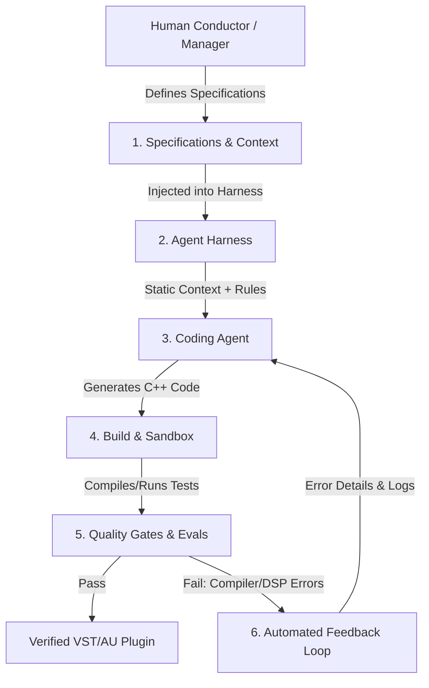

# _VST_Factory: Agentic Coding Ecosystem Roadmap
## For VST/AU Audio Effects & Software Synthesizers

This document outlines the architecture, harness design, and multi-phase implementation roadmap for **_VST_Factory**—an autonomous agentic engineering system designed to generate, test, and polish production-grade audio plugins using C++20, the JUCE Framework, and CMake.

---



---

## 1. The Core Vision: Agentic Audio Engineering

Traditional "vibe coding" (ad-hoc natural language prompts) is highly prone to failure when applied to audio plugin development. Professional audio software demands strict adherence to real-time CPU constraints, sample-accurate math, and thread safety. A single memory allocation in the audio loop can cause audio dropouts, and a division-by-zero can emit painful signals or crash the host Digital Audio Workstation (DAW).

The **_VST_Factory** transitions audio development from vibe coding to **Agentic Engineering** by implementing the **Factory Model**:
*   **The Developer as the Factory Manager:** You express high-level DSP intent, architectural rules, and target constraints.
*   **The Harness as the Assembly Line:** A structured runtime environment containing specialized tools, compiling sandboxes, and automated testing suites.
*   **The Agents as the Production Line Workers:** AI models operating within the harness, iteratively writing and self-correcting code until all safety and quality gates are passed.

---

## 2. The Audio Agent Harness

An agent is only as capable as its tools. For the _VST_Factory, we define a specialized audio-centric harness wrapper:

```text
┌────────────────────────────────────────────────────────────────────────┐
│                          VST_FACTORY HARNESS                           │
│                                                                        │
│  ┌────────────────────────┐  ┌──────────────────────────────────────┐  │
│  │ STATIC CONTEXT         │  │ AUDIO DEVELOPER TOOLS                │  │
│  │ * AGENTS.md            │  │ * CMake compile & build tools        │  │
│  │ * JUCE 8 & C++20 Rules │  │ * Audio rendering shims (Offline)    │  │
│  │ * Real-time safety     │  │ * Catch2 / GoogleTest execution      │  │
│  └────────────────────────┘  └──────────────────────────────────────┘  │
│  ┌────────────────────────┐  ┌──────────────────────────────────────┐  │
│  │ DYNAMIC CONTEXT        │  │ AUTOMATED QUALITY GATES              │  │
│  │ * DSP specs & schemas  │  │ * Null testing (Output vs Golden)    │  │
│  │ * API header indexing  │  │ * CPU profiling (blocks/microsecs)   │  │
│  │ * Error logs           │  │ * NaN & denormal value checkers      │  │
│  └────────────────────────┘  └──────────────────────────────────────┘  │
└────────────────────────────────────────────────────────────────────────┘
```

### Key Harness Components
1.  **Isolated Build Sandbox:** A secure local directory containing a pre-configured CMake project linked to JUCE. The agent can trigger builds and parse error logs directly without human intervention.
2.  **Offline Audio Renderer:** A command-line tool that loads the generated plugin, feeds it MIDI or input audio files, renders the output offline (faster than real-time), and outputs WAV files for analysis.
3.  **DSP Evaluators:** Mathematical analyzers that check rendered output files for:
    *   **NaN (Not a Number) or Infinity:** Inflicted by division-by-zero or unstable filter coefficients.
    *   **Clipping & Denormals:** Unintended signal levels or near-zero floats causing CPU spikes.
4.  **CPU Profiler:** Measures execution time inside the audio thread callback under different polyphony settings.

---

## 3. The Audio AGENTS.md (Static Context)

To guide the agent's behavior from step one, a strict set of rules is embedded as static context. Below is the blueprint of the standard `AGENTS.md` injected into the _VST_Factory ecosystem:

```markdown
# VST Factory Operating Guidelines

## Technology Stack
* C++20
* JUCE Framework (v8.0+)
* CMake (v3.22+)

## Real-Time Audio Thread Safety (CRITICAL)
Within any class inheriting from juce::AudioProcessor or within the processBlock callback, the following are strictly prohibited:
1. NO memory allocations (e.g., `new`, `malloc`, `std::vector::push_back`, `juce::Array::add`). All buffers, delay lines, and state objects must be pre-allocated in `prepareToPlay()`.
2. NO system calls or logging (e.g., `std::cout`, `DBG()`, file operations).
3. NO locking mechanisms (e.g., `std::mutex`, `std::unique_lock`). Use lock-free atomic states or lock-free ring buffers (e.g., `juce::AbstractFifo`) for UI-to-audio communications.
4. Keep calculations block-size and sample-rate independent. Always query host values in `prepareToPlay()` and update filter/envelope coefficients dynamically.

## Code Separation Strategy
* **Source/DSP/**: Pure signal processing (oscillators, filters, saturators). Must have zero dependencies on JUCE UI classes.
* **Source/Core/**: Plugin wrapping, APVTS initialization, parameter layout, MIDI mapping.
* **Source/UI/**: Visual rendering, editor layouts, knob attachments. UI must only read/write states using APVTS or thread-safe message queues.
```

---

## 4. Quality Gates & Automated Verification

In a factory model, verification is automated. The harness runs a multi-tier test battery on every generated codebase:

### Tier 1: Compilation and Syntax Checks
*   The harness runs `cmake --build build --target test_target` and captures stderr.
*   Compilation failures are fed back to the agent with line-specific errors.

### Tier 2: DSP Correctness & Analytical Testing
*   **Null / Golden Testing:** The agent generates an offline rendering test. It runs a test audio file through the DSP block, compares the output with a pre-rendered "golden" WAV file, and calculates phase/amplitude deviations.
*   **Coefficient Stability Tests:** Sweeps modulation parameters (e.g., cutoff frequency from 20Hz to 20kHz) at high speeds to ensure the filter poles do not cross the unit circle (instability).

### Tier 3: Host Stability & Real-Time Performance
*   **CPU Profiling (Microsecond Gates):** Measures callback execution time. If processing a block of 512 samples at 44.1kHz takes longer than $5$ microseconds per voice on the test platform, the test fails, prompting optimization.
*   **MIDI Stress Testing:** Bombards synth engines with high-density polyphonic MIDI notes, rapid pitch bends, and CC parameters to test voice allocation stability and memory leakages under heavy polyphony.

---

## 5. Ecosystem Roadmap

Building the VST_Factory is divided into five evolutionary phases, progressing from basic automation to a fully autonomous multi-agent audio factory.

### Phase 1: Environment & Sandbox Bootstrapping
*   **Goal:** Establish the sandboxed directory structure and basic CMake compilation harness.
*   **Milestones:**
    *   [ ] Configure a generic JUCE plugin template.
    *   [ ] Set up the dynamic static-context system (`AGENTS.md`).
    *   [ ] Build an execution tool that compiles the plugin locally and pipes errors to a standardized JSON schema.

### Phase 2: Offline DSP Testing Harness
*   **Goal:** Enable the agent to verify audio output without launching a DAW.
*   **Milestones:**
    *   [ ] Write a command-line offline host that loads the plugin DLL/VST3 and processes an input WAV/MIDI file.
    *   [ ] Implement a python/C++ analysis tool that reads output WAV files and checks for NaNs, clipping, or DC offset.
    *   [ ] Create a basic Catch2/JUCE DSP test template for unit testing.

### Phase 3: The DSP "Conductor" Engine
*   **Goal:** Enable autonomous DSP code generation for individual modules.
*   **Milestones:**
    *   [ ] Create a specialized **DSP Agent** prompt template focused on audio mathematical translation.
    *   [ ] Support automated scaffolding of standard modules: oscillators (VA, wavetable), filters (ZDF, ladder), envelopes, and basic effects (distortion, delay).
    *   [ ] Establish the feedback loop: auto-correcting DSP code when coefficient stability or null tests fail.

### Phase 4: UI/UX & Parameter Glue Generator
*   **Goal:** Automate the mapping of DSP parameters to the host UI and APVTS.
*   **Milestones:**
    *   [ ] Enable the agent to parse a DSP module's parameter requirements and generate the corresponding `Parameters.h` file.
    *   [ ] Implement layout rules to auto-generate standard JUCE components (sliders, buttons) attached to the `AudioProcessorValueTreeState`.
    *   [ ] Generate simple UI visualizations (e.g., scope, FFT preview).

### Phase 5: Multi-Agent Collaborative Factory
*   **Goal:** Orchestrate multiple specialized agents to build a complete plugin from scratch.
*   **Milestones:**
    *   [ ] **Orchestrator Agent:** Interprets human specifications (e.g., "Build a tape saturation plugin with an EQ") and delegates work.
    *   [ ] **DSP Agent:** Implements and refines algorithms.
    *   [ ] **UI Agent:** Designs the interface, knobs, and panels.
    *   [ ] **QA Agent:** Writes unit tests, runs offline profiling, and verifies the final VST3 package.
